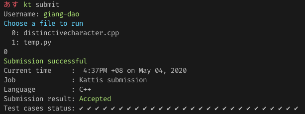

# * kt * Kattis command line helper
Inspired by (and works well with) xalanq's [codeforce tool](https://github.com/xalanq/cf-tool)


## Sample usage

### Generate folder for problem statement and sample intputs and outputs
```bash
python kt.py gen <problem_id>
```

For example, if you want to attempt problem [Distinctive Character](https://open.kattis.com/problems/distinctivecharacter), the problem ID is `distinctivecharacter`. From your kattis working folder, type in
```bash
python kt.py gen distinctivecharacter
```
You should be able to see 2 set of sample inputs/outputs generated in a folder called `distinctivecharacter`

After you can `cd` into the folder and start working on the problem. If you use xalanq's codeforce tool, you can simply `cf gen` to generate a template code file. If you want to test your code, simply use `cf test`


### Submit file and check result on the terminal
> Only works with C++ for now

From your current problem folder
```bash
python kt.py submit
```
You should be able to see how many test cases your code has passed so far

Eventually, if things go well, you should be able to see the final result



## Installation
- Preferably python 3
- Install dependencies by `python -m pip install --upgrade -r requirements.txt`
- Generate cython libs by `python setup.py build_ext --inplace`
- For convenience, rename the `kt.py` to `kt`, set it executable `sudo chmod +x kt` and add current path to your `$PATH` env variable, so later you only need to invoke the command by using only `kt` (For eg `kt submit`)
- [Download your kattisrc file](https://open.kattis.com/download/kattisrc) and put it in your `$HOME` directory (ie `~/.kattisrc`) 


## Todo
- [ ] `kt gen` (Behave likes `cf gen`)
- [ ] `kt test` (Behave likes `cf test`)
- [ ] Add support for other languages beside from C++

## Reference 
- https://github.com/Kattis/kattis-cli

***
# License
[MIT License](LICENSE)
