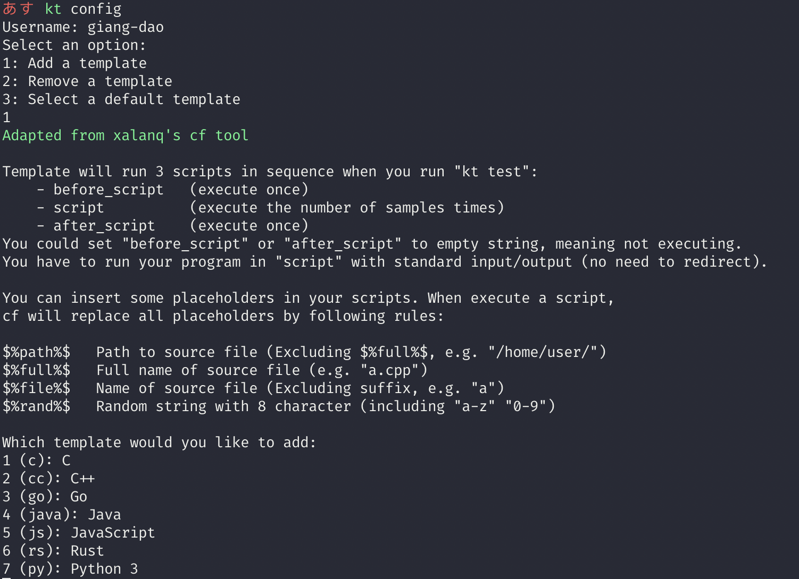
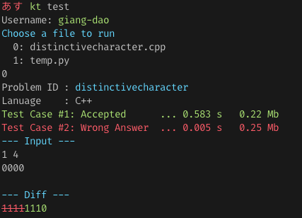

# * kt * Kattis command line helper


Inspired by (and works well with) xalanq's [codeforce tool](https://github.com/xalanq/cf-tool)


## Sample usage

### 1. Config your template type
First and foremost, [download your kattisrc file](https://open.kattis.com/download/kattisrc) and put it in your `$HOME` directory (ie `~/.kattisrc`). After that, run
```bash
kt config
```
to configure your code template. This will allow the tool to quickly generate code template for your problem.



### 2. Generate folder for problem statement and sample intputs and outputs
```bash
kt gen <problem_id>
```

For example, if you want to attempt problem [Distinctive Character](https://open.kattis.com/problems/distinctivecharacter), the problem ID is `distinctivecharacter`. From your kattis working folder, type in
```bash
kt gen distinctivecharacter
```
You should be able to see 2 set of sample inputs/outputs generated in a folder called `distinctivecharacter`


After that, you can `cd` into the folder and start working on the problem. 

### 3. Test your code
If you've set up your config properly, you should be ready to test whether your code pass sample input and output. Simply run
```bash
kt test
```
And observe the difference ..



### Submit file and check result on the terminal

From your current problem folder
```bash
kt submit
```
You should be able to see how many test cases your code has passed so far


## Installation
```bash
pip install --upgrade kttool
```

## Reference 
- https://github.com/Kattis/kattis-cli
- https://github.com/xalanq/cf-tool

***
# License
[MIT License](LICENSE)
